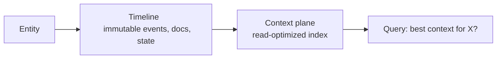
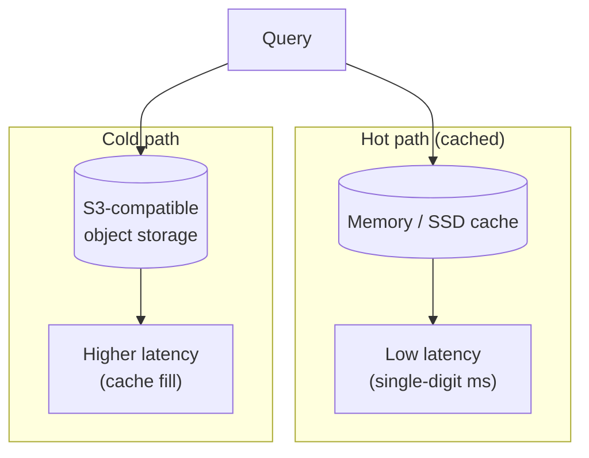
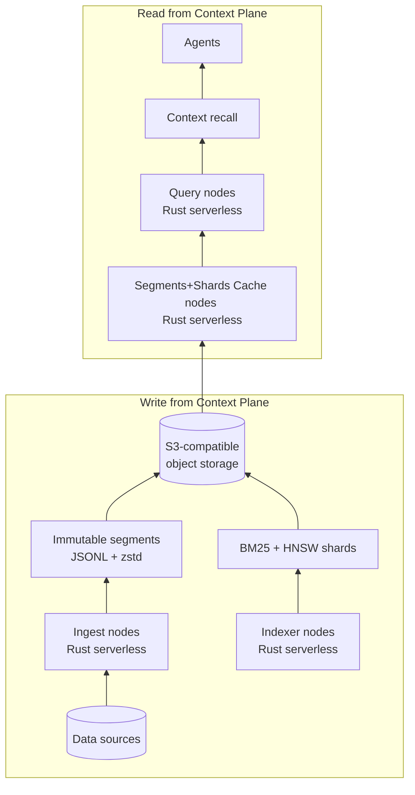
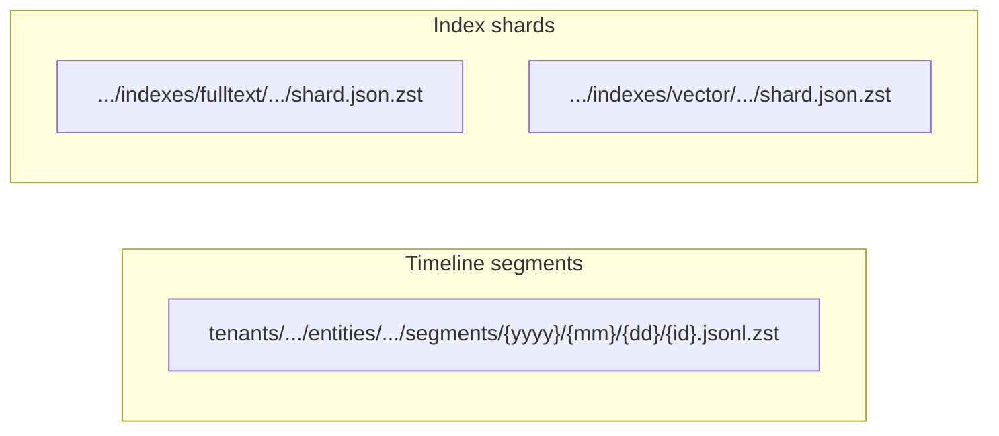
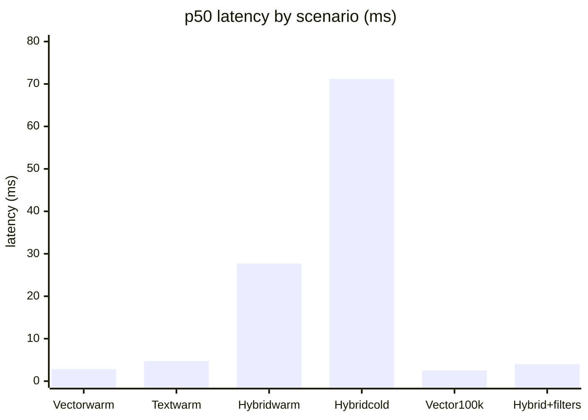

Motivation: introduce my perspective on context plane for AI agents, sketch an architecture I believe in, and share early findings and benchmarks.

---

## Why I care about context plane

AI agents need context. Not “more tokens” but **the right context**, for the right entity, at the right time. Today teams often solve that by stuffing prompts, calling five APIs, or maintaining a separate “context service” that nobody wants to own. What about a cleaner primitive: a **context plane**. A deterministic, read-optimized view of an entity’s timeline that agents can query with one mental model and one API.

## What defines a context plane?

A **context plane** amounts to a snapshot of everything known about an entity (a user, a company, a lead, an agent) in a form that’s easy to search and easy to materialize for an LLM. The entity has a **timeline**: immutable events, documents, messages, state changes. The plane acts as the read-optimized index over that timeline—so an agent can ask _“Give me the best context for user X”_ or _“What does the system know about account Y?”_ without reaching into a dozen systems.

Two properties matter to me:

1. **Entity-first.** The entity acts as the primary key. Namespace per account, per user, per lead—not one giant corpus with filters after the fact. That matches how GTM and support and product teams actually think: “this account,” “this user.”

2. **Deterministic materialization.** Given a query (text, vector, filters, time window), one can produce a reproducible context bundle—for example, a schema like `customer_context_v0`—that an agent consumes. No ad-hoc stitching at query time.

If that sounds like “search + entity-scoped index,” that holds—with an opinion: the source of truth remains **append-only timeline segments** and **immutable index shards**, not a live database. That leads to a specific architecture.

---

## An architecture I believe in

I want the system to stay **object-storage-first** and **stateless at the query layer**, with **S3-compatible object storage** as the single source of truth and the rest implemented in **Rust** for highly scalable, serverless-friendly execution. So:

- **Storage:** **S3-compatible object storage** (for example, AWS S3, RustFS, Cloudflare R2, or local) serves as the system of record. No primary database. Ingest writes immutable segments (JSONL + zstd) per entity per day; an indexer builds BM25 and vector (HNSW) shards per tenant per day and writes them back. Lifecycle policies, multi-tenant paths, and compliance stay simple and auditable.

- **Compute (Rust, serverless):** Ingest, indexer, and query nodes run in **Rust** so they can run as **highly scalable serverless** workloads: stateless, low cold start, scale-to-zero or scale-out on demand. Query nodes load shards and segments from object storage into memory or local cache on demand; you can restart, scale out, or rebuild from storage at any time. No coordination for “which node has which shard”—just cache fill and eviction.

- **Cold/warm economics:** Only a subset of entities stay hot at any moment. Hot entities get fast, cached retrieval; cold ones remain queryable from S3-compatible storage with higher latency. Cost scales with how much you cache, not with “index everything in RAM.”

Cost scales with how much you cache; cold data stays queryable from S3-compatible storage.

Concretely:

**Compute** runs in Rust—stateless, scalable, serverless-friendly.

**Storage** compatible with S3, RustFS, R2, or local.

Storage layout stays simple and auditable:

- **Timeline segments:** `tenants/{tenant}/entities/{entity}/segments/{yyyy}/{mm}/{dd}/{id}.jsonl.zst`
- **Index shards:** `tenants/{tenant}/indexes/fulltext/{yyyy}/{mm}/{dd}/shard.json.zst` and same for `vector/`

Cheap append-only writes, lifecycle-friendly for S3, and easy to reason about for multi-tenant and compliance.

---

## Intended audience

A good reference use case amounts to what Vercel’s GTM team did with their corpus ([turbopuffer Vercel case study](https://turbopuffer.com/customers/vercel)). Gong, Slack, Salesforce per Salesforce account, so AI lead agents can search an account’s full history at runtime. One index per account, hybrid (BM25 + vector) search, agents with a search tool. Context plane target that same shape: **entity = account/user/lead**, **namespace per entity**, **hybrid search**, **cold/warm economics**. Internal tools, GTM, support, and product—anywhere “give me the best context for this entity” remains the question.

---

## Early findings

I’ve built and benchmark an implementation in this direction: **Rust** for ingest, indexer, and query nodes, with **S3-compatible object storage** as the only durable store—so it can run as highly scalable serverless (stateless, scale-out, no primary DB). A few lessons so far.

**Warm path sits in good shape.** For vector-only and text-only queries at modest QPS, latency lands where I’d hope: single-digit to low tens of milliseconds (for example, vector warm ~2.8 ms p50, text warm ~4.7 ms p50 at 10k docs, 40 QPS). Hybrid warm runs a bit higher but still reasonable (~27 ms p50). Thus the core “load shard, run BM25 + vector, merge” path works.

**Cold and filter-heavy paths dominate the pain.** When shards aren’t cached or when one adds heavy filters (for example, many entity IDs, time ranges), tail latency blows up—for example, hybrid cold p99 in the tens of seconds in early runs. That’s the main gap vs. “napkin math”: cache locality and filter evaluation cost. Thus the next bets include filter-first candidate reduction, better shard prefetch, and keeping hot loops SIMD-friendly (more below).

**Zero-cost abstractions can still hide cost.** I’ve re-read work like [turbopuffer’s post on zero-cost abstractions vs SIMD](https://turbopuffer.com/blog/zero-cost): iterators that return one element per `next()` can prevent the compiler from vectorizing. The fix uses batched iterators and tight loops over contiguous data. The implementation lacks an LSM-style merge iterator so far, but the lesson holds: **profile first**, then look at LLVM IR or flame graphs when the numbers don’t match the model. Mechanical sympathy beats trusting the abstraction.

---

## Benchmarks (early 2026)

All from a single machine, same benchmark harness.

**p50 latency (ms)**—warm paths in single digits to low tens; cold and hybrid higher:

| Scenario                       | Dataset     | p50      | p99        | Note                   |
| ------------------------------ | ----------- | -------- | ---------- | ---------------------- |
| Vector warm                    | 10k, dim 64 | 2.80 ms  | 15.17 ms   | Strong baseline        |
| Text warm                      | 10k         | 4.74 ms  | 18.18 ms   | Strong baseline        |
| Hybrid warm                    | 10k         | 27.65 ms | 130.05 ms  | Usable                 |
| Hybrid cold                    | 10k         | 71.17 ms | **28.7 s** | Tail marks the problem |
| Vector (100k, 100 d)           | glove-style | 2.54 ms  | 18.94 ms   | Scales okay            |
| Hybrid + filters (100k, 384 d) | arxiv-style | 4.00 ms  | 630 ms     | Filter-heavy tail      |

| Path         | Status | Takeaway                                       |
| ------------ | ------ | ---------------------------------------------- |
| Warm vector  | Good   | Single-digit ms p50, strong baseline           |
| Warm text    | Good   | Low ms p50, strong baseline                    |
| Hybrid warm  | Usable | ~27 ms p50, core merge path works              |
| Hybrid cold  | Pain   | p99 in tens of seconds, cache/shard bottleneck |
| Filter-heavy | Pain   | Tail latency, filter-first reduction needed    |

Thus: **warm vector and text sit in a good place**; **hybrid cold and filter-heavy workloads sit where the work lies**. No claim of parity with commercial search APIs—the goal remains to stay honest about the profile and improve from here (filter ordering, vector stage layout, shard prefetch, SIMD where it pays).

---

## What’s next

- Tighten the cold path and filter-first planning so p95/p99 under hybrid + filters improve without regressing the warm baseline.
- Keep **S3-compatible object storage** as the single source of truth and **Rust** query/index/ingest stateless and serverless-friendly; double down on cache layers and prefetch policy.
- Document one canonical end-to-end use case (ingest → index → query → entity context) and keep publishing the approach with every number.

---

## Wrapping up

A context plane, in my view, represents the right primitive for “give me the best context for this entity”: entity-scoped, timeline-backed, hybrid search, with a read-optimized architecture that keeps **S3-compatible object storage** as truth and **Rust**-based ingest, indexer, and query nodes **stateless and serverless-friendly**. The architecture I’m betting on—immutable segments, daily shards, cold/warm caching—already shows solid warm-path performance and clear bottlenecks in cold and filter-heavy regimes. If you’re building agents that need deterministic, entity-scoped context, I’d love to hear how you’re thinking about it.

---
