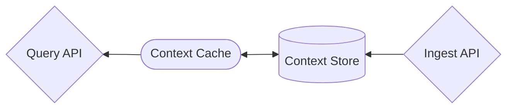
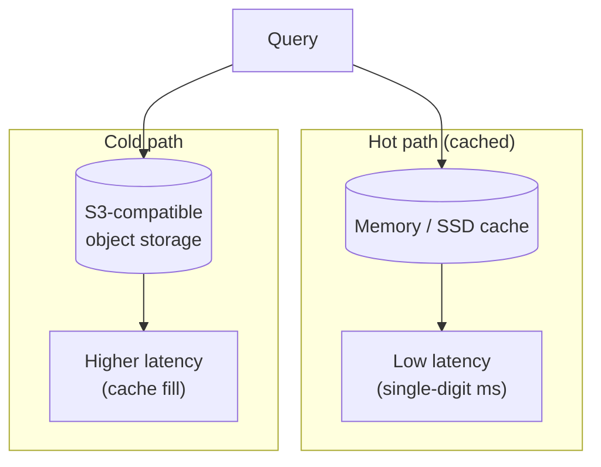
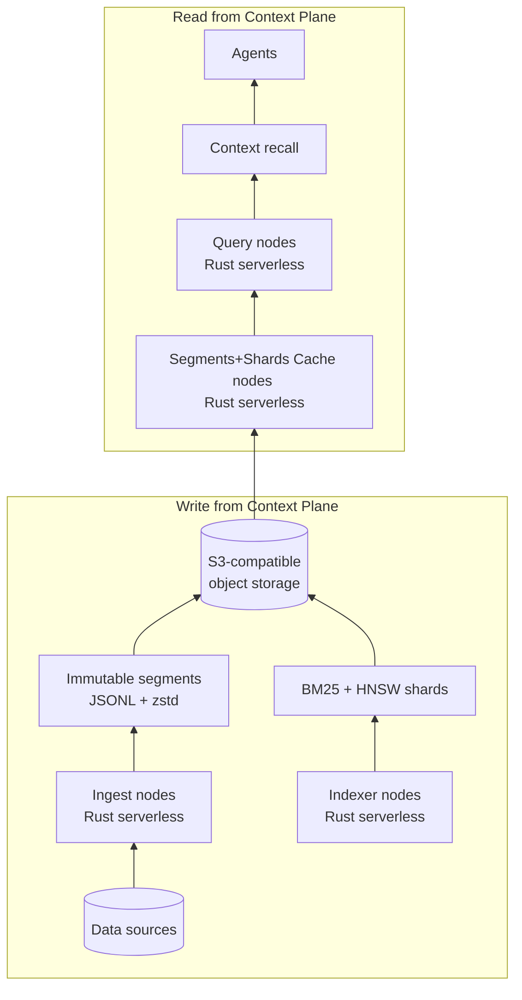
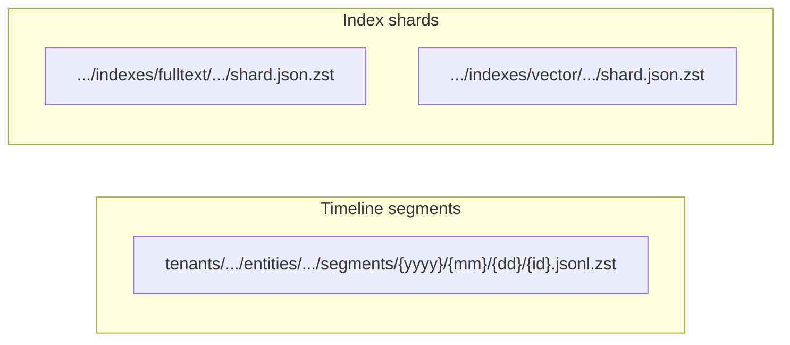
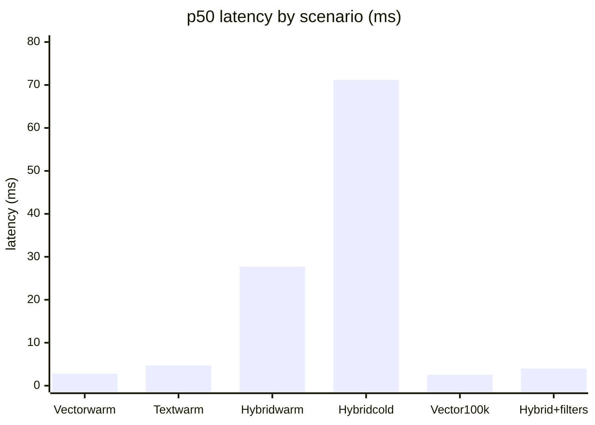

Motivation: I introduce my perspective on context plane for AI agents, sketch an architecture I believe in, and share early findings and benchmarks. Why does this matter to you? Read on.

---

## Why I care about context plane

AI agents need context. Not "more tokens" but **the right context**, for the right entity, at the right time. Today teams often solve that by stuffing prompts, calling five APIs, or maintaining a separate "context service" that nobody wants to own. What about a cleaner primitive? A **context plane** (infrastructure that builds, stores, and serves context so agents can query it with one mental model and one API). Before defining it, it helps to see why the current approach breaks.

---

## The problem: runtime context assembly

Today most AI applications build context **during the request**. Consider a concrete case:

`Example scenario: product growth agent: 10k customers, identify ~5% to contact for upselling.`

With runtime context assembly you must do the following **per customer** (× 10,000):

```
per customer
  → fetch CRM
  → fetch support tickets
  → fetch product usage
  → fetch billing data
  → construct prompt
  → run model
```

The agent then uses that context to identify the list of customers to reach out to. So: 10,000 × (4 upstream calls + prompt build + model run). Any slow or failing dependency blocks progress.

This architecture works for demos but breaks at scale.

| Metric                           | p50       | p99      | Note                                                                                              | Improvement |
| -------------------------------- | --------- | -------- | ------------------------------------------------------------------------------------------------- | ----------- |
| **Context latency**              | ~3-8 h    | timeouts | 10k × (1-3 s per customer). Serial or limited parallelism; one slow dep blocks.                   | n/a         |
| **Reliability**                  | 100%      | &lt;90%  | 10k runs; 1 of N APIs fails per customer → many failures. Joint success drops fast.               | n/a         |
| **Tokens (total)**               | 500M      | 2 B+     | 10k × 50k-200k. Raw data from CRM, tickets, logs, emails.                                         | n/a         |
| **Rate limits**                  | throttled | blocked  | 10k × 4 = 40k upstream API calls. Human-tier limits → you hit them.                               | n/a         |
| **Cost (input + output, total)** | ~$930     | ~$3,600  | Input: 500M-2 B tokens @ $1.75/1M. Output: small (list/details of ~5% worth contacting) @ $14/1M. | n/a         |

This architecture proves unreliable and expensive ($1k-4k every time you run this agent question).

That calls for a different architecture: treat context as **derived state**, not something assembled on every request. The infrastructure that provides it: the **Context Plane**.

---

## The solution: a context plane

Instead of having the agent fetch context directly from data sources, the **Context Plane** sits with the **Data Plane** on one side and the **Agent Plane** on the other. It stores and serves pre-built context.

`Same example scenario: product growth agent: 10k customers, identify ~5% to contact.`

Context for each customer already **materializes** in the Context Store/Cache (built by pipelines or ingest, on your schedule). The agent no longer does 10k × (fetch CRM + support + usage + billing). The agent **reads context for customer 1 … 10,000** off the plane (single read per customer, sub-50 ms when warm), runs the model on each, then identifies the list to contact. No 10k× fan-out to upstream APIs.


Same metrics, with the estimates below when using a context plane:

| Metric                           | p50      | p99      | Note                                                                                                                                                                                                                           | Improvement      |
| -------------------------------- | -------- | -------- | ------------------------------------------------------------------------------------------------------------------------------------------------------------------------------------------------------------------------------ | ---------------- |
| **Context latency**              | ~1-3 min | ~2-5 min | Single read per customer from cache/store; p90 in the tens of ms. 10k reads in parallel → total run in minutes.                                                                                                                | ~100-500× lower  |
| **Reliability**                  | 100%     | 99.9%    | One read per customer from store/cache; no N-way dependency.                                                                                                                                                                   | ~2% higher       |
| **Tokens (total)**               | 0.5M     | 2M       | 10k × 50-200 tokens. **Heavily summarised** (e.g. one snippet or score per customer). You control compression and schema.                                                                                                      | ~250-1000× fewer |
| **Rate limits**                  | 1k+/min  | 1k+/min  | The cache serves 10k reads. Upstream API calls stay at zero (no 40k).                                                                                                                                                          | no throttle      |
| **Cost (input + output, total)** | ~$0.05   | ~$0.20   | Teams build and cache indexes anyway for multi-account/thematic use (e.g. "Which customers look likely to upgrade?" across accounts). Marginal cost: LLM on minimal context (0.5M-2M tokens cached @ $0.175/1M) + cache reads. | ~1000× lower     |

The agent no longer pays for N round-trips and token bloat on every request.

**Disclaimer: cost of ingest and indexing.** Building and maintaining the context store carries a cost. Ingesting and indexing data into it consume compute, storage, and operational overhead. That cost drives the choice of architecture below: **Rust** serverless for ingest and query, with a **cache layer** backed by **S3-compatible blob storage** as the durable store. You keep ingest and indexing lean, scale with usage, and only pay for what you cache hot.

The Context Plane **infrastructure** stores and serves context for AI systems. It has two core components (**Context Cache** and **Context Store**). How data gets into the store (pipelines, ETL, or an ingest API) falls to engineering or data teams and their preferred tools.



So: **context plane = context cache + context store**. That keeps the idea simple and implementable.

Two properties matter to me:

1. **Entity-first.** The entity acts as the primary key. Namespace per account, per user, per lead, not one giant corpus with filters after the fact. That matches how GTM and support and product teams think: "this account," "this user."

2. **Deterministic materialization.** Given a query (text, vector, filters, time window), you can produce a reproducible context bundle (e.g. a schema like `customer_context_v0`) that an agent consumes. No ad-hoc stitching at query time.

---

## An architecture I believe in

I want the system to stay **object-storage-first** and **stateless at the query layer**, with **S3-compatible object storage** as the single source of truth and the rest implemented in **Rust** for serverless-friendly execution that scales. So:

- **Storage:** **S3-compatible object storage** (e.g. AWS S3, RustFS, Cloudflare R2, or local) acts as the system of record. No primary database. Ingest writes immutable segments (JSONL + zstd) per entity per day; an indexer builds BM25 and vector (HNSW) shards per tenant per day and writes them back. Lifecycle policies, multi-tenant paths, and compliance stay simple and auditable.

- **Compute (Rust, serverless):** Ingest, indexer, and query nodes run in **Rust** so they can run as **serverless** workloads that scale: stateless, low cold start, scale-to-zero or scale-out on demand. Query nodes load shards and segments from object storage into memory or local cache on demand; you can restart, scale out, or rebuild from storage at any time. No coordination for "which node has which shard" (cache fill and eviction).

- **Cold/warm economics:** Only a subset of entities stay hot at any moment. Hot entities get fast, cached retrieval; cold ones remain queryable from S3-compatible storage with higher latency. Cost scales with how much you cache, not with "index everything in RAM."



Cost scales with how much you cache. Cold data stays queryable from S3-compatible storage.

Concretely:

**Compute** runs in Rust: stateless, serverless-friendly, and scales with load.

**Storage** compatible with S3, RustFS, R2, or local.



Storage layout stays simple and auditable:



- **Timeline segments:** `tenants/{tenant}/entities/{entity}/segments/{yyyy}/{mm}/{dd}/{id}.jsonl.zst`
- **Index shards:** `tenants/{tenant}/indexes/fulltext/{yyyy}/{mm}/{dd}/shard.json.zst` and same for `vector/`

Cheap append-only writes, lifecycle-friendly for S3, and easy to reason about for multi-tenant and compliance.

---

## Intended audience

A good reference use case amounts to what Vercel's GTM team did with their corpus ([turbopuffer Vercel case study](https://turbopuffer.com/customers/vercel)). Gong, Slack, Salesforce per Salesforce account, so AI lead agents can search an account's full history at runtime. One index per account, hybrid (BM25 + vector) search, agents with a search tool. Context plane targets that same shape: **entity = account/user/lead**, **namespace per entity**, **hybrid search**, **cold/warm economics**. Internal tools, GTM, support, and product (anywhere "give me the best context for this entity" remains the question).

---

## Early findings

I've built and benchmarked a prototype in this direction (**Rust** for ingest, indexer, and query nodes, with **S3-compatible object storage** as the only durable store) so it can run as serverless that scales (stateless, scale-out, no primary DB). A few lessons so far.

**Warm path sits in good shape.** For vector-only and text-only queries at modest QPS, latency lands where I'd hope: single-digit to low tens of milliseconds (e.g. vector warm ~2.8 ms p50, text warm ~4.7 ms p50 at 10k docs, 40 QPS). Hybrid warm runs a bit higher but still reasonable (~27 ms p50). So the core "load shard, run BM25 + vector, merge" path works.

**Cold and filter-heavy paths dominate the pain.** When shards sit uncached or when you add heavy filters (e.g. many entity IDs, time ranges), tail latency blows up (e.g. hybrid cold p99 in the tens of seconds in early runs. That marks the main gap vs. "napkin math": cache locality and filter evaluation cost. So the next bets include filter-first candidate reduction, better shard prefetch, and keeping hot loops SIMD-friendly (more below).

**Zero-cost abstractions can still hide cost.** I've re-read work like [turbopuffer's post on zero-cost abstractions vs SIMD](https://turbopuffer.com/blog/zero-cost): iterators that return one element per `next()` can prevent the compiler from vectorizing. The fix uses batched iterators and tight loops over contiguous data. The codebase lacks an LSM-style merge iterator so far, but the lesson holds: **profile first**, then look at LLVM IR or flame graphs when the numbers don't match the model. Mechanical sympathy beats trusting the abstraction.

---

## Benchmarks (early 2026)

All from a single machine, same benchmark harness.

**p50 latency (ms)**: warm paths in single digits to low tens, cold and hybrid higher:



| Scenario                       | Dataset     | p50      | p99        | Note                   |
| ------------------------------ | ----------- | -------- | ---------- | ---------------------- |
| Vector warm                    | 10k, dim 64 | 2.80 ms  | 15.17 ms   | Strong baseline        |
| Text warm                      | 10k         | 4.74 ms  | 18.18 ms   | Strong baseline        |
| Hybrid warm                    | 10k         | 27.65 ms | 130.05 ms  | Usable                 |
| Hybrid cold                    | 10k         | 71.17 ms | **28.7 s** | Tail marks the problem |
| Vector (100k, 100 d)           | glove-style | 2.54 ms  | 18.94 ms   | Scales okay            |
| Hybrid + filters (100k, 384 d) | arxiv-style | 4.00 ms  | 630 ms     | Filter-heavy tail      |

| Path         | Status | Takeaway                                       |
| ------------ | ------ | ---------------------------------------------- |
| Warm vector  | Good   | Single-digit ms p50, strong baseline           |
| Warm text    | Good   | Low ms p50, strong baseline                    |
| Hybrid warm  | Usable | ~27 ms p50, core merge path works              |
| Hybrid cold  | Pain   | p99 in tens of seconds, cache/shard bottleneck |
| Filter-heavy | Pain   | Tail latency, filter-first reduction needed    |

So: **warm vector and text sit in a good place**. **Hybrid cold and filter-heavy workloads sit where the work lies**. No claim of parity with commercial search APIs. The goal remains to stay honest about the profile and improve from here: filter ordering, vector stage layout, shard prefetch, SIMD where it pays.

---

## Next steps

- Tighten the cold path and filter-first planning so p95/p99 under hybrid + filters improve without regressing the warm baseline.
- Keep **S3-compatible object storage** as the single source of truth and **Rust** query/index/ingest stateless and serverless-friendly; double down on cache layers and prefetch policy.
- Document one canonical end-to-end use case (ingest → index → query → entity context) and keep publishing the approach with every number.

---

## Wrapping up

The Context Plane equals **context store + context cache**: infrastructure that stores and serves context so AI agents get the right context at the right time. It treats context as derived state instead of something assembled on every request, reducing latency, cost, and failure surface. The architecture I bet on (S3-compatible object storage as truth, Rust-based ingest/indexer/query nodes, immutable segments, daily shards, cold/warm caching) already shows solid warm-path performance and clear bottlenecks in cold and filter-heavy regimes. If you build agents that need deterministic, entity-scoped context, I would love to hear how you think about it.

---
